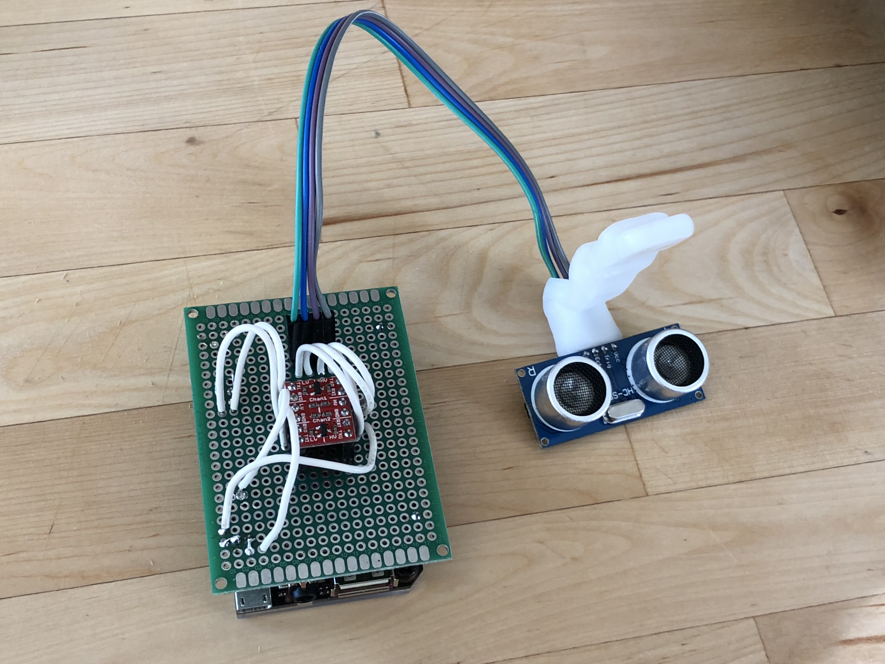

# Monitoring a christmas tree's water level with a CHIP and an ultrasonic rangefinder.

Christmas tree fires kill about 6 people every year.
[Dry trees burn faster.](https://www.theverge.com/2017/11/28/16707896/christmas-tree-fires-nist-candles-decoration-flames)
Don't let your Christmas tree dry out prematurely by forgetting to water it:
have it text you whenever the water level is low.

## The hardware

Last year, I took 10 wires, placed one end of each of them at a different depth in the water, and used a Beaglebone's GPIO pins to measure connectivity between them to measure water level.
This has poor resolution, and corrosion/gunk buildup at the underwater end of the wires can make it stop working.
Water isn't as conductive as you might think:
 the pull-up resistors on my sense pins were sometimes enough to cause false readings.
Also, since my Beaglebone doesn't have built-in wifi, I had to run an Ethernet cable to my Christmas tree.

This year, I'm using an inexpensive HC-SR04 ultrasonic rangefinder attached to a [CHIP](https://getchip.com/pages/chip) to measure the water level.
The rangefinder is attached to the top of the water bowl, pointing down at the top of the water.
By measuring the distance to the water, and subtracting from the distance to the bottom of the bowl, we can calculate the water depth.

The HC-SR04 is a 5V device, while the CHIP is 3.3v, which means we need a level converter.

I wired things up on a perf board just to keep things tidy:

More detailed wiring instructions are available in the README for [spi_hcsr04](https://github.com/EvanKrall/spi_hcsr04).

## The software

### Interfacing with the rangefinder

The rangefinder operation is pretty simple:

 - You set the Trig pin high for a little bit
 - The rangefinder sends out a 40kHz burst
 - The rangefinder sets its Echo pin high for the amount of time it takes to receive an echo.

Unfortunately, Linux GPIO is not known for being very fast, and Linux isn't a real-time operating system.
This means that we can't just set interrupts on a GPIO pin and compare the system clock at the beginning/end and expect any level of accuracy.
(If we want ~1cm precision, we need timing accuracy of ~29 microseconds.)

To achieve reasonably accurate timing, I'm pretending like the HC-SR04 is an [SPI](https://en.wikipedia.org/wiki/Serial_Peripheral_Interface_Bus) device.
SPI is full-duplex: the master sends data on MOSI at the same time the slave sends data on MISO.
Linux provides an [interface for SPI](https://www.kernel.org/doc/html/v4.11/driver-api/spi.html):
 you build a struct with parameters like clock speed and pointers to RX and TX buffers, then pass that to the kernel using the [`ioctl`](http://man7.org/linux/man-pages/man2/ioctl.2.html) syscall.
This syscall will block while the transfer occurs, and then you can read the response data from the RX buffer.

By connecting MOSI to the rangefinder's Trig pin, we can trigger the rangefinder by sending it some 1s.
Then, by connecting MISO to the rangefinder's Echo pin, we can see the response.
We just need to pad the transmit buffer so that it's long enough to see the whole echo pulse, then count the number of high bits in the response.

I've published the code to do this on [my Github](https://github.com/EvanKrall/spi_hcsr04)

### Alerting

I've written a [simple script](check_water_level.sh) to check the water level and return 2 if the level is too low.

I've set up [consul](https://github.com/hashicorp/consul) to run my check,
 and have [consul-alerts](https://github.com/AcalephStorage/consul-alerts)
 [configured to send alerts via](https://github.com/AcalephStorage/consul-alerts#amazon-web-services-simple-notification-service-sns)
 [AWS SNS](https://aws.amazon.com/sns/).
The SNS topic is configured to [send text messages](https://docs.aws.amazon.com/sns/latest/dg/sms_publish-to-topic.html) to my and my roommates' phones.

Why consul-alerts?
I'm already running a consul cluster, so this was a low-effort solution for me.
Consul-alerts will tell me if the CHIP loses power or crashes (assuming my consul servers are up).
However, other monitoring systems like [Nagios](https://www.nagios.org/), [Icinga](https://www.icinga.com/), or [Sensu](https://sensuapp.org/) could work.

For fewer dependencies, you could also modify the script to use the [AWS CLI to publish](https://docs.aws.amazon.com/cli/latest/userguide/cli-sqs-queue-sns-topic.html) directly to your SNS topic.